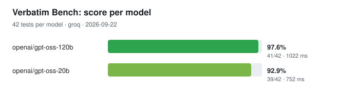
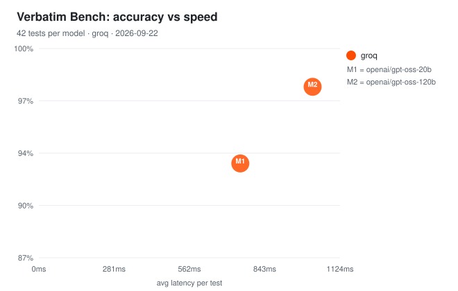
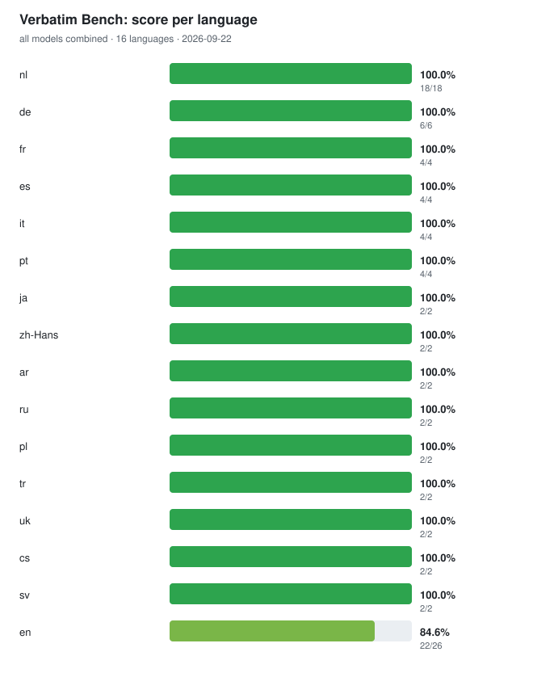

# Verbatim Bench

Benchmark for speech-to-text post-processing models. It sends the same transcript-cleaning prompt to every model and shows which one actually follows the rules.

Run it like this:

```
node bench.mjs --provider groq --models openai/gpt-oss-120b
```

## Results

Latest run: 22 September 2026, via Groq, 42 tests per model with the prompt from `prompt.txt`.




| Model | Score | Passed | Avg latency |
|---|---|---|---|
| `openai/gpt-oss-120b` | 97.6% | 41/42 | 1022 ms |
| `openai/gpt-oss-20b` | 92.9% | 39/42 | 752 ms |





What stood out: no model follows the Helium rule, so with a Helium window you get cleaned text instead of `NULL`. The small model also leaves `five dollars` unconverted and cuts a test email off halfway. Every other language scores 100%.

## Requirements

Only Node 18 or newer. Nothing to install: no `npm install`, no dependencies. Check with `node --version`.

You need an API key from a provider of your choice. The benchmark talks to any OpenAI-compatible API.

## Quick start

Set your key as an env var (PowerShell):

```
$env:GROQ_API_KEY = "gsk-..."
node bench.mjs --provider groq --models openai/gpt-oss-120b
```

With OpenRouter:

```
$env:OPENROUTER_API_KEY = "sk-or-..."
node bench.mjs --provider openrouter --all
```

On Linux/macOS use `export GROQ_API_KEY="gsk-..."` instead of `$env:`.

To keep the key out of your shell history, put it in a file and use `--api-key-file key.txt`. That file is in `.gitignore`, so you will not commit it by accident.

## What the benchmark tests

The default run is 42 tests: 26 strict tests plus a smoke test for 16 core languages. Each strict test checks one or more rules from the prompt in `prompt.txt`:

- removing filler (`um`, `ehm`, `zeg maar`)
- converting spoken numbers (`vijf euro` to `€5`, `ten percent` to `10%`)
- converting spoken operators (`plus` to `+`, `keer` to `*`)
- bullet lists, clean email formatting, addresses like `jan@voorbeeld.nl`
- turning `new line` and `nieuwe alinea` into line breaks
- spoken punctuation and emoji (`fire emoji` to 🔥)
- the Helium rule: with a window name like `Helium - voice notes` the output must be exactly `NULL`
- returning only the cleaned text, no markdown or commentary

The smoke test sends a short transcript with filler per language and checks four things: filler gone, no code fences, not empty, no crash or refusal. Full output per language is in `results.json`, so you can judge language preservation yourself.

## Languages

The language list comes from Handy (`cjpais/handy`, `src/lib/constants/languages.ts`). The default run covers en, nl, de, fr, es, it, pt, ja, zh-Hans, ar, ru, pl, tr, uk, cs and sv. With `--all-langs` you test all 100+ Handy languages. That costs more calls: 1 model x 128 tests.

## Keys, providers and new models

Before each run the bench validates every configured key and shows which providers work:

```
node bench.mjs --all-providers
```

It also compares the models it finds with `models-known.json`. If a provider added models since your last run, it lists them and asks whether to test them too. Pass `--yes` to accept without asking (used in CI), or `--all` to test everything.

Free Groq models are all covered this way: `--all` tests every chat model on your key. STT, TTS and guard models are skipped unless you pass `--include-non-chat`.

## Useful commands

Show available models:

```
node bench.mjs --provider groq --list-models
```

Compare two models on Dutch and English:

```
node bench.mjs --provider groq --models openai/gpt-oss-120b,openai/gpt-oss-20b --lang nl,en
```

Test everything at OpenRouter (slow, every model id runs all tests):

```
node bench.mjs --provider openrouter --all --all-langs
```

See what a run would do, without API calls:

```
node bench.mjs --provider groq --models openai/gpt-oss-120b --dry-run
```

Check the scoring itself, without a key:

```
node bench.mjs --self-test
```

Regenerate the charts from existing results:

```
node chart.mjs results.json
```

## All options

| Option | What it does |
|---|---|
| `--provider NAME` | `groq`, `openrouter`, `openai`, `cerebras`, `zai` or `custom`. Without it, the bench picks the provider with a key set, else `groq`. |
| `--providers a,b` | Run on several providers at once (keys via env vars). |
| `--all-providers` | Run on every provider that has a key configured. |
| `--api-key XXX` | Key passed directly. Wins over env vars (single-provider runs). |
| `--api-key-file F` | Read the key from a file. |
| `--base-url URL` | Custom endpoint, for example a local server. Combine with `--provider custom`. |
| `--models a,b,c` | Which models (single-provider runs only). |
| `--all` | Test every chat model from `/models`. |
| `--include-non-chat` | Also test STT/TTS/guard models. |
| `--list-models` | Show models and stop. |
| `--lang nl,en` | Only test these languages. |
| `--all-langs` | Test all Handy languages. |
| `--deep-only` | Skip smoke tests. |
| `--prompt-file F` | Custom system prompt (default: `prompt.txt`). `${output}` is ignored, `${active_window}` gets filled in. |
| `--active-window S` | Value for `${active_window}` (default: `VS Code`). |
| `--known-models F` | Snapshot of known model ids (default: `models-known.json`). |
| `--yes` | Accept new models without asking. |
| `--concurrency N` | Parallel requests (default: 3). |
| `--timeout S` | Timeout per request in seconds (default: 60). |
| `--retries N` | Retries on 429/5xx with backoff (default: 3). |
| `--out-json F` | JSON results (default: `results.json`). |
| `--out-md F` | Markdown ranking (default: `results.md`). |
| `--no-out` | Write no files. |
| `--no-charts` | Skip regenerating the SVG charts. |
| `--verbose` | Show every model output during the run. |

## How scoring works

Per model you see the pass rate, passed/total, average latency and failing categories. The ranking sorts by score, then by speed. After that comes a per-language score across all models, so you can see which languages lag behind.

`results.json` holds everything: metadata, timing, every output and every failed check. `results.md` is the short ranking for a PR or issue. The SVG charts regenerate automatically after each run.

## Your own prompt

The default is `prompt.txt`, exactly the Handy prompt with `${output}` and `${active_window}`. Handy sends the transcript as a separate user message, so the bench does the same. With `--prompt-file` you point at your own prompt; the same `${...}` rules apply.

## GitHub Actions

Yes, it runs in CI. The workflow in `.github/workflows/bench.yml` starts manually from the Actions tab or weekly on Monday 06:00 UTC.

Add your keys as repo secrets (`GROQ_API_KEY`, `OPENROUTER_API_KEY`, ...), then pick a provider and options in the run dialog. The workflow uses `--concurrency 1 --retries 5 --yes`, uploads `results.json`, `results.md` and the charts as artifacts, and commits fresh charts back to `main` so this page stays current.

## If something breaks

`No working API key`: set the env var for your provider, or use `--api-key` or `--api-key-file`.

`GET /models failed`: the bench falls back to known model names. If that fails too, pass explicit `--models`.

`HTTP 429`: you hit a rate limit. Lower `--concurrency` to 1 and raise `--retries`.

`HTTP 401`: your key is wrong or belongs to another provider. Check that `--provider` matches your key.

`HTTP 403 model blocked`: the model is disabled in your provider project settings. The bench reports it per test and moves on.

Timeouts on slow models: raise `--timeout`, for example `--timeout 120`.

## Files

- `bench.mjs`: the benchmark itself
- `brand.mjs`: banner, colors and live progress bar
- `chart.mjs`: builds `chart-models.svg`, `chart-langs.svg` and `chart-scatter.svg` (`node chart.mjs`)
- `prompt.txt`: the tested system prompt
- `langs.mjs`: Handy languages and the core set
- `cases.mjs`: strict tests and smoke texts per language
- `models-known.json`: snapshot for the new-model check
- `results.json` / `results.md`: output of your latest run (ignored by git)
